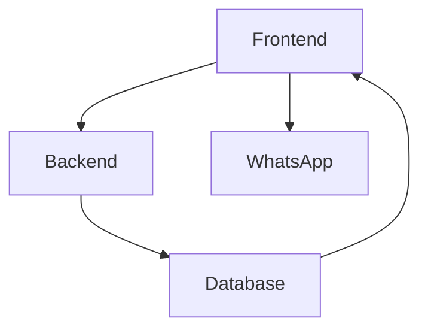

+-----------------------------+
|    FRONTEND (React)         |
| - React 19 + TypeScript     |
| - Vite build tool           |
| - Tailwind CSS v4           |
| - React Router v7           |
| - Components:               |
|   - Layout (Sidebar/TopBar) |
|   - UI Elements (Buttons, Modals) |
|   - Pages (Customers, Sources, etc.) |
| - Data Flow:                 |
|   - Calls /api endpoint      |
|   - Real-time updates        |
+-----------------------------+

+-----------------------------+
|    BACKEND (Express.js)     |
| - REST API endpoints        |
| - TypeORM ORM               |
| - MySQL database            |
| - Audit logging             |
| - Bill number generator     |
| - Authentication (Basic)    |
| - PowerShell integrations    |
+-----------------------------+

+-----------------------------+
|    DATABASE (MySQL)         |
| - Docker container          |
| - Tables:                    |
|   - customer                 |
|   - box_entry                |
|   - inventory_source         |
|   - audit_log                |
| - Connection details:        |
|   - Host: localhost:3308     |
|   - DB: fit_db               |
|   - Users: fit_user/fit_password|
+-----------------------------+

+-----------------------------+
|    EXTERNAL SERVICES        |
| - WhatsApp sharing (Windows) |
| - OS-level protocol handler  |
| - PowerShell scripts         |
| - Zero-API cost sharing      |
+-----------------------------+

